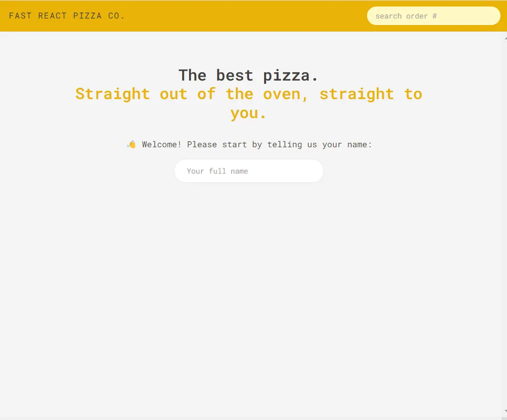

### 👋 **I am Erhan ERTEM**

&emsp;

## Udemy The Ultimate React Course 2023: React, Redux & More by Jonas Schmedtmann

### **Objective:** Create Fast React Pizza Co. App

- React folder structure and project planning
- Practice w/React-router for SPA
- Practice w/React-router for remote state management(fetching)
- Practice w/Redux for Global UI state management

&emsp;

#### Link to Project &rarr; [Fast React Pizza Co.](https://app-fastreactpizzaco-erhan-ertem.netlify.app/)

---

    

Installed NPM packages and utilized APIs:

| Package command                                 | Package link | Description                 |
| ----------------------------------------------- | ------------ | --------------------------- |
| npm create vite@latest                          |              |                             |
| npm i eslint -D                                 |              |                             |
| npm i vite-plugin-eslint -D                     |              |                             |
| npm i eslint-config-react-app -D                |              |                             |
| npm install -D tailwindcss postcss autoprefixer |              | Install tailwind for vite   |
| npx tailwindcss init -p                         |              | Create tailwind config file |

&emsp;
